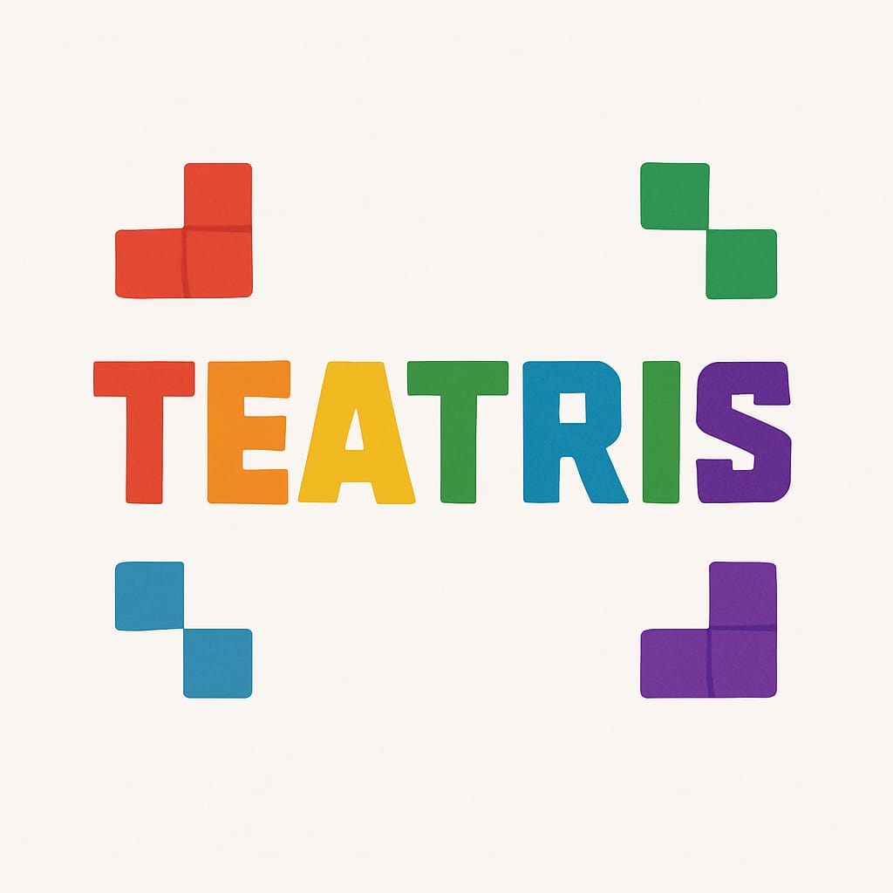
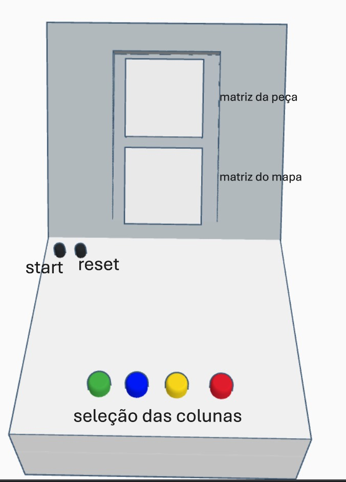
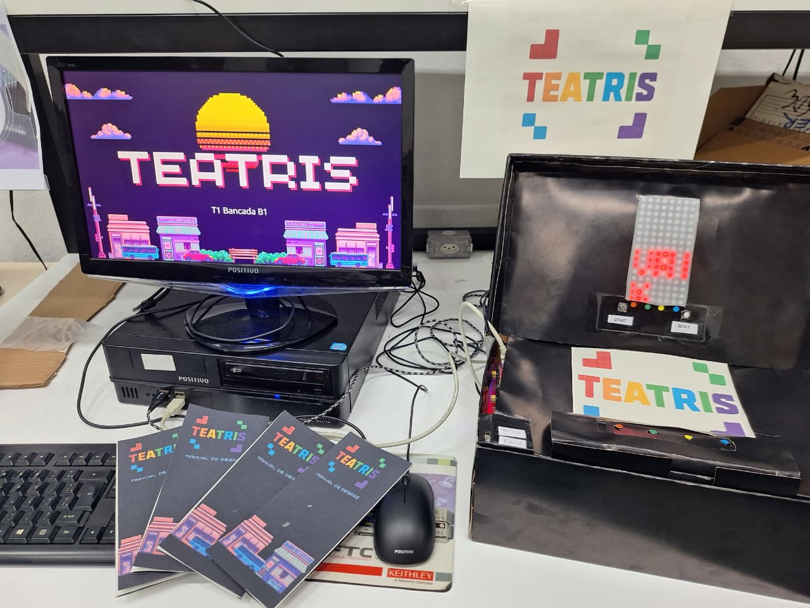

**TEAtris** é um jogo educacional inspirado no Tetris, desenvolvido para rodar em **FPGA** com o uso de **duas matrizes de LEDs 8x8**. 

O jogo tem como objetivo estimular a percepção visual, o raciocínio espacial e o controle do tempo de reação dos jogadores. A mecânica também permite aplicação como ferramenta de apoio para análise cognitiva de crianças com **Transtorno do Espectro Autista (TEA)**.

---
## 👨‍👩‍👦 Equipe de Desenvolvimento

Este projeto foi desenvolvido pelos alunos da Turma 1, Bancada B1, da Escola Politécnica da Universidade de São Paulo, como parte da disciplina **PCS3635 – Laboratório Digital I**.

| Integrante                          | Nº USP     |
|------------------------------------|------------|
| 🎯 Wesley Oliveira Cunha           | 14612367   | 
| 💡 Claudio Lucio Cunha da Silva    | 14565003   | 
| 🔧 Daniel Henrique Braga da Silva  | 14565431   | 

> Juntos, unimos engenharia, criatividade e propósito social para transformar LEDs em aprendizado. ✨

---

## 🧠 Propósito

O TEAtris foi projetado para:

- Desenvolver e testar circuitos digitais complexos em FPGA
- Estimular o raciocínio visual e percepção de padrões
- Contabilizar erros como forma de avaliar impulsividade e adaptação
- Potencialmente auxiliar no acompanhamento de **crianças com TEA** em ambiente lúdico

---

## 🛠️ Tecnologias e componentes

- **Linguagem:** Verilog HDL
- **Plataforma:** FPGA DE0-CV
- **Interfaces:** Matrizes de LEDs 8x8 (2088BS), botões físicos
- **Software:** Intel Quartus Prime + Visual Studio Code + Drawn.io (para os esquemas)

---

## 🕹️ Funcionamento

O jogo apresenta uma peça na **matriz superior**. O jogador deve pressionar um dos 4 botões para selecionar a coluna correta na **matriz inferior**, encaixando a peça no espaço disponível do mapa.

- Erros são contabilizados
- Tempo limite de 8 segundos por jogada
- 2 níveis de dificuldade: fácil e difícil
- Transições animadas e feedback visual

---

## 📷 Ilustrações

### Esboço do Protótipo:

### Montagem final para apresentação:

---

## 📄 Documentação

- 📘 [Manual de Regras do Jogo](./docs/Manual_teatris.pdf)
- 📗 [Relatório Técnico Final](./docs/PCS3635-T1BB1-Relato_Final.pdf)

---

## 📺 Demonstração em Vídeo

Assista à apresentação oficial do projeto:
[🔗 Link para o vídeo explicativo](https://www.youtube.com/watch?v=vvYHG5I3Ibs&ab_channel=cl_audio)

